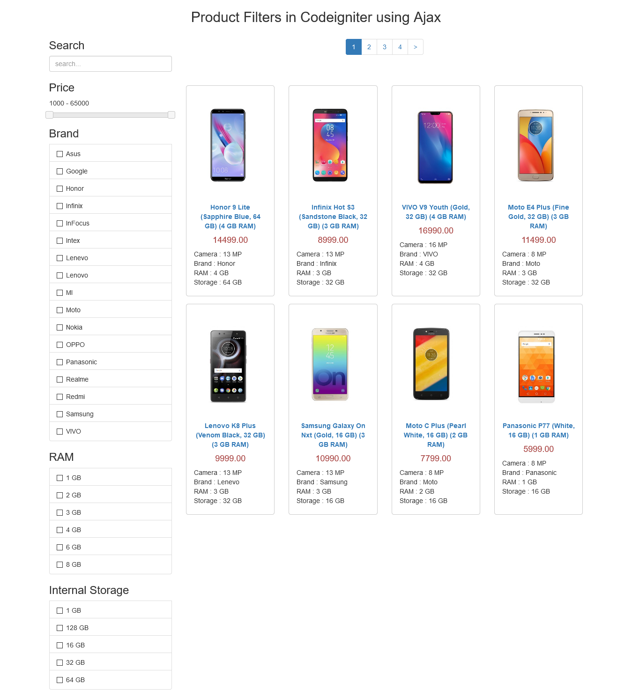
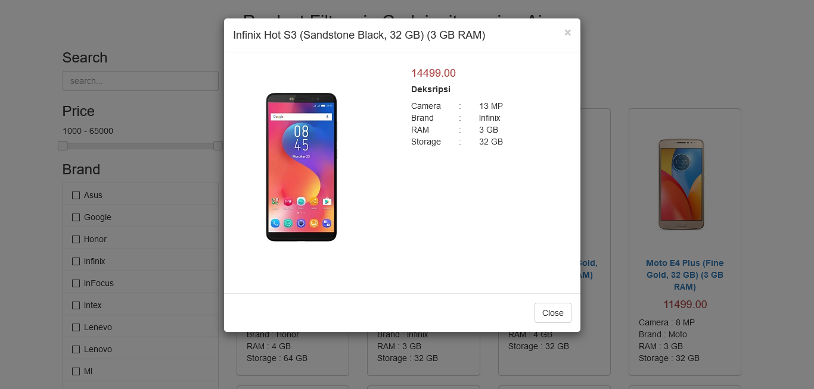

# Product filter using Ajax
A simple website which is displaying a list of products and filtering product by price, brand, ram, and internal storage. This website build using Codeigniter 3, Bootstrap 3.4.1, and jQuery 3.5.1. This project is developed from [Web Lesson - Ajax Codeigniter Product Filter with Pagination](https://www.webslesson.info/2018/12/ajax-codeigniter-product-filter-with-pagination.html).

### Features
- Display products
- Filter product by price, brand, ram, and internal storage
- Search product by name
- View detail product

### Screenshot

### Note
The logic of this project refers to this source  
[Codeigniter 3](https://codeigniter.com/download) 
[Bootstrap 3](https://getbootstrap.com/docs/3.4/getting-started/) 
[Jquery 3](https://jquery.com) 
[Stackoverflow for issue click doesn't work on ajax generated content](https://stackoverflow.com/questions/9344306/jquery-click-doesnt-work-on-ajax-generated-content) 

###################
What is CodeIgniter
###################

CodeIgniter is an Application Development Framework - a toolkit - for people
who build web sites using PHP. Its goal is to enable you to develop projects
much faster than you could if you were writing code from scratch, by providing
a rich set of libraries for commonly needed tasks, as well as a simple
interface and logical structure to access these libraries. CodeIgniter lets
you creatively focus on your project by minimizing the amount of code needed
for a given task.

*******************
Release Information
*******************

This repo contains in-development code for future releases. To download the
latest stable release please visit the `CodeIgniter Downloads
<https://codeigniter.com/download>`_ page.

**************************
Changelog and New Features
**************************

You can find a list of all changes for each release in the `user
guide change log <https://github.com/bcit-ci/CodeIgniter/blob/develop/user_guide_src/source/changelog.rst>`_.

*******************
Server Requirements
*******************

PHP version 5.6 or newer is recommended.

It should work on 5.3.7 as well, but we strongly advise you NOT to run
such old versions of PHP, because of potential security and performance
issues, as well as missing features.

************
Installation
************

Please see the `installation section <https://codeigniter.com/user_guide/installation/index.html>`_
of the CodeIgniter User Guide.

*******
License
*******

Please see the `license
agreement <https://github.com/bcit-ci/CodeIgniter/blob/develop/user_guide_src/source/license.rst>`_.

*********
Resources
*********

-  `User Guide <https://codeigniter.com/docs>`_
-  `Language File Translations <https://github.com/bcit-ci/codeigniter3-translations>`_
-  `Community Forums <http://forum.codeigniter.com/>`_
-  `Community Wiki <https://github.com/bcit-ci/CodeIgniter/wiki>`_
-  `Community Slack Channel <https://codeigniterchat.slack.com>`_

Report security issues to our `Security Panel <mailto:security@codeigniter.com>`_
or via our `page on HackerOne <https://hackerone.com/codeigniter>`_, thank you.

***************
Acknowledgement
***************

The CodeIgniter team would like to thank EllisLab, all the
contributors to the CodeIgniter project and you, the CodeIgniter user.
